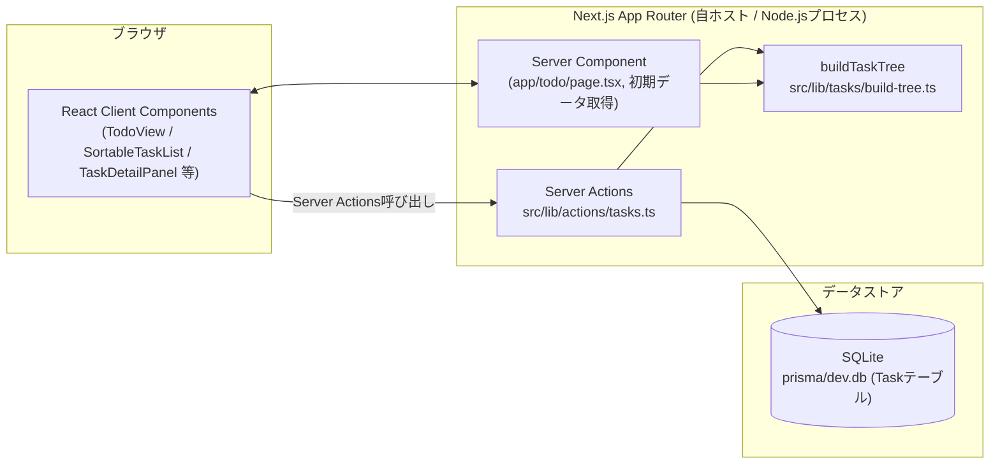
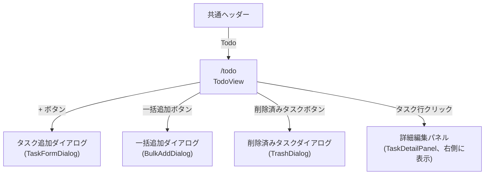

# Todo機能 基本設計書

## 0. 本書について

- [Todo要件定義書](./要件定義書.md)で整理した要件をもとに、実装済みの画面構成・データベース・処理フローを記録する基本設計書である。
- 進捗ダッシュボード機能の[基本設計書](../進捗ダッシュボード/基本設計書.md)と同じ構成・記法で記述し、両機能のドキュメント間の一貫性を保つ。

## 1. システム構成

### 1.1 全体アーキテクチャ



- 進捗ダッシュボード機能と同様、フロントエンド/バックエンドを分離せず、Server Component(初期表示データ取得)とServer Actions(更新系処理)で完結させる。外部API・ローカルLLM等の依存は持たない。
- `Task`は自己参照の`parentId`を持つフラットなテーブルであり、`buildTaskTree`がサーバー側で親子関係を`TodoTask.children`のツリー構造に組み立ててからクライアントへ渡す。クライアント側は常にツリー構造(`TodoTask[]`)で状態を保持する。

### 1.2 ディレクトリ構成

```
src/
  app/
    todo/
      page.tsx                 # Server Component。Task一覧取得→buildTaskTree→TodoViewへ渡す
  components/
    todo/
      todo-view.tsx             # 画面全体を統括するクライアントコンポーネント
      sortable-task-list.tsx    # ドラッグ&ドロップ対応の一覧(クライアント専用描画。3.3節)
      task-list-item.tsx        # 1タスク行(再帰コンポーネント)
      task-detail-panel.tsx     # 選択中タスクの詳細編集パネル
      task-form-dialog.tsx      # 新規タスク追加ダイアログ
      bulk-add-dialog.tsx       # テキスト一括追加ダイアログ
      bulk-parse.ts             # 一括追加テキストのパース(タブインデント→階層)
      export-import-menu.tsx    # エクスポート/インポートのドロップダウン
      import-export.ts          # JSON/CSV変換ロジック
      trash-dialog.tsx          # 削除済みタスク(ゴミ箱)ダイアログ
      date-range-fields.tsx     # 期間入力欄+バリデーション+表示用フォーマッタ
      filters.ts                # 検索・フィルタの型と適用ロジック
      priority.ts / priority-picker.tsx   # 優先度の表示メタ・ピッカー
      status.ts / status-picker.tsx       # ステータスの表示メタ・ピッカー
      tags-input.tsx            # タグ入力欄
      types.ts                  # Todo共通の型・純粋関数群(ツリー操作等)
  lib/
    actions/
      tasks.ts                  # "use server" Task用CRUD・並び替え・ゴミ箱Action
    tasks/
      build-tree.ts             # フラットなTask[]→TodoTask[]ツリー変換
      tags.ts                   # タグのシリアライズ/デシリアライズ(カンマ区切り文字列⇔配列)
prisma/
  schema.prisma                 # Taskモデル(進捗ダッシュボード機能のモデル群より前段に定義)
```

---

## 2. 画面一覧・画面遷移

| 画面ID | 画面名 | パス | 概要 |
| --- | --- | --- | --- |
| SCR-T01 | Todo一覧・詳細 | `/todo` | タスクの一覧(左)+選択中タスクの詳細編集(右、選択時のみ表示) |

`/todo`はヘッダーの「Todo」ナビ項目から遷移する単一画面であり、タスク追加・一括追加・削除済みタスクはいずれも同一画面上のダイアログとして開く(別画面遷移は発生しない)。

### 2.1 画面遷移図



---

## 3. 共通設計

### 3.1 階層データの持ち方

- DB(`Task`テーブル)は`parentId`によるフラットな自己参照構造。
- サーバー側(`app/todo/page.tsx`、および各Server Actionの戻り値)は、`deletedAt: null`のTaskを全件取得したうえで`buildTaskTree`によりネストした`TodoTask[]`へ変換してから返す。クライアントは常にこのツリー構造を`useState`で保持し、Server Action成功時は戻り値のツリーで丸ごと置換する(進捗ダッシュボード機能のActionパターンと同一)。
- ツリーに対する検索・パス取得・並び替え等はすべて`types.ts`のツリー再帰関数(`findTask`/`findPath`/`replaceSiblingOrder`等、4.2節)で行う。

### 3.2 フィルタ・並び替え・進捗集計の適用順序

- 表示用配列は`sortTasksForDisplay(tasks, sortMode)`→`filterTaskTree(sorted, filters)`の順で毎回`useMemo`により算出する(元の`tasks` stateは変更しない)。
- 進捗集計(ヘッダーの完了率)は`countTasks(tasks)`を**フィルタ適用前の生の`tasks`**に対して行う(フィルタで絞り込んでも全体の完了率表示は変わらない)。
- ドラッグ&ドロップは「追加順」表示かつフィルタ非適用の場合のみ有効化する(3.3節・要件定義書 5.5節)。表示順とDB上の`order`が一致している状態でのみ、ドラッグ操作の意味が一意に定まるため。

### 3.3 ドラッグ&ドロップとSSRの両立

- `@dnd-kit`(`useDraggable`/`useSortable`)はDOM要素にmodule-levelカウンタ由来の`aria-describedby="DndDescribedBy-N"`を付与する。このNはサーバー描画とクライアント初回描画とで一致しないため、そのままSSRするとハイドレーションエラーになる(進捗ダッシュボード機能の`ProgressMatrixView`で先に確認済みの問題)。
- そのため、ドラッグ&ドロップを含む一覧描画部分を`SortableTaskList`として`TodoView`から分離し、`next/dynamic(..., { ssr: false })`でクライアント専用描画にしている。`TodoView`自体(検索・フィルタ・追加ダイアログ等)は通常どおりSSRする。

### 3.4 論理削除・ゴミ箱

- 進捗ダッシュボード機能の`Project`と同じ`deletedAt`(nullable `DateTime`)方式を`Task`にも用いる。
- 削除は**サブツリー再帰**で行う(`softDeleteSubtree`): 対象タスクとその配下すべてに同一の`deletedAt`をセットする。復元(`restoreSubtree`)も同様に再帰的に行う。
- 進捗ダッシュボード機能の`Project`(30日保持・自動的な残り日数表示)とは異なり、Todoのゴミ箱には保持期間の概念が無い。削除済みタスクは完全削除するまで無期限にゴミ箱へ残り続ける。

---

## 4. 画面設計

### 4.1 SCR-T01 Todo一覧・詳細

**構成コンポーネント**: `TodoView`(クライアント)

```
┌──────────────────────────────────────────────────────────────┐
│ 今日のTodo                              [====------] 4/10 完了 │
│ 2026年9月8日(火)                                                │
├──────────────────────────────────────────────────────────────┤
│                                    [⇅エクスポート/インポート] [🗑削除済みタスク] │
├───────────────────────┬──────────────────────────────────────┤
│ [+][一括][展開][折畳][並替▾] │ 発注機能の設計を進める              │
│ [検索............] │ 進行中（40%）                     [🗑] │
│ [状態:すべて▾][優先度:▾][期限:▾] │                          │
│ ▶ 企画資料をまとめる         │ ステータス [未着手][進行中][完了]      │
│ ▶ 週次ミーティングの準備      │ 優先順位 [未設定][高][中][低]         │
│ ⋮ タスクを追加             │ 期間 [開始日] 〜 [終了日]             │
│                          │ タグ [タグ1][タグ2] [+]              │
│                          │ メモ [.......................]      │
│                          │                          [保存]     │
└───────────────────────┴──────────────────────────────────────┘
```

- 左ペイン: ヘッダー操作群(追加・一括追加・全展開/折りたたみ・並び替え)、検索欄、フィルタ(ステータス/優先度/期限)、タスク一覧(`SortableTaskList`→`TaskListItem`の再帰)。
- 右ペイン: タスクを選択している間のみ表示(`grid-cols-[22rem_1fr]`)。`TaskDetailPanel`が選択中タスクの詳細編集フォームを表示する。未選択時は右ペインを表示せず、左ペインが全幅になる。

**データ取得**:
- `app/todo/page.tsx`で`deletedAt: null`の`Task`全件を取得し`buildTaskTree`でツリー化、`TodoView`へ`initialTasks`として渡す(SSR初期描画。以降はServer Actionの戻り値で状態更新)。
- 検索・フィルタ・並び替え・展開状態・選択状態はすべてクライアントの`useState`で保持し、サーバーへの再フェッチは発生しない。

**主な操作とServer Actionsの対応**:

| 操作 | 呼び出すAction | 補足 |
| --- | --- | --- |
| タスク追加(ダイアログ送信) | `createTaskAction` | 3.1節。成功時トーストに「元に戻す」(完全削除で取り消し) |
| タスク一括追加 | `createTasksBulkAction` | ルートのタスクID群を保持し、「元に戻す」で`permanentlyDeleteTasksAction`により一括取り消し |
| JSON/CSVインポート | `importTasksAction` | 「元に戻す」は提供しない(件数が不定のため) |
| タスク編集(詳細パネル保存) | `updateTaskAction` | ステータス変更時の`progress`自動補正あり(5.2節) |
| タスク行のドラッグ&ドロップ | `reorderTasksAction` | 3.2節の条件下でのみ有効。5.3節 |
| 優先度変更(一覧のドロップダウン) | `updateTaskAction(id, { priority })` | 詳細パネルを開かずに変更可能 |
| タスク複製 | `duplicateTaskAction` | サブツリーごと複製。「元に戻す」で完全削除 |
| タスク削除 | `deleteTaskAction` | 論理削除(サブツリー再帰)。「元に戻す」で`restoreTaskAction` |
| 削除済みタスク一覧表示 | `getDeletedTasksAction` | ゴミ箱ダイアログを開いた時点で取得 |
| 復元 | `restoreTaskAction` | サブツリー再帰で復元 |
| 完全削除(個別/一括) | `permanentlyDeleteTaskAction` / `permanentlyDeleteTasksAction` | 物理削除。取り消し不可 |

### 4.2 タスク追加・一括追加ダイアログ

- `TaskFormDialog`: タスク名・優先度・期間・タグ・メモを入力する単一フォーム。サブタスク追加時は`heading`が「サブタスクを追加」に変わる(親IDはコンポーネント外から`addDialog.parentId`として管理)。
- `BulkAddDialog`: テキストエリアに1行1タスクを入力し、Tabキーでインデント(サブタスク階層)を挿入できる。入力内容は`parseBulkTaskText`でリアルタイムにパースし、件数をフッターに表示する。

### 4.3 ゴミ箱(削除済みタスクダイアログ)

- `TrashDialog`が削除済みタスクの一覧(削除日時・配下の削除済みサブタスク件数)を表示し、行ごとに復元・完全削除ボタンを持つ。完全削除は`AlertDialog`で確認する。
- 一覧に表示されるのは「削除済みルート」(自身が削除済みで、かつ親が削除済みでない、または親を持たないタスク)のみ。削除済みの親配下の子はネストされた件数として集約表示し、個別の行としては出さない。

---

## 5. データベース設計

### 5.1 Prismaスキーマ(実装済み)

```prisma
model Task {
  id        String   @id @default(cuid())
  title     String
  status    String   @default("not_started")
  priority  Int?
  memo      String   @default("")
  startDate DateTime?
  endDate   DateTime?
  progress  Int      @default(0)
  tags      String   @default("")
  order     Int      @default(0)
  parentId  String?
  parent    Task?    @relation("TaskChildren", fields: [parentId], references: [id], onDelete: Cascade)
  children  Task[]   @relation("TaskChildren")
  deletedAt DateTime?
  createdAt DateTime @default(now())
  updatedAt DateTime @updatedAt

  @@index([parentId])
  @@index([deletedAt])
}
```

- `tags`はDB上カンマ区切りの`String`として保持し(`serializeTags`/`parseTags`、`src/lib/tasks/tags.ts`)、クライアント/Server Actionの型では`string[]`として扱う。
- `priority`はDB上`Int?`(1=高、2=中、3=低、null=未設定)。
- `parentId`の自己参照は`onDelete: Cascade`だが、通常操作では論理削除(`deletedAt`セット)を使うため、物理的なCascade削除はゴミ箱からの完全削除時のみ発生する。

### 5.2 インデックス方針

- `parentId`: ツリー構築(`buildTaskTree`)・兄弟件数取得(`nextOrder`)・子孫の再帰検索(削除/復元/複製)で高頻度に参照するため付与。
- `deletedAt`: 一覧取得(`deletedAt: null`)とゴミ箱取得(`deletedAt: { not: null }`)の両方で使うため付与。

---

## 6. Server Actions設計(`src/lib/actions/tasks.ts`)

既存パターン(`"use server"`、更新後`revalidatePath("/todo")`、最新データを返す)を踏襲する。

| 関数 | 入力 | 出力 | 概要 |
| --- | --- | --- | --- |
| `createTaskAction` | `{ title, priority, memo?, startDate?, endDate?, tags?, parentId }` | `{ id, tree }` | `order`は兄弟件数から算出 |
| `createTasksBulkAction` | `BulkTaskInput[], parentId` | `{ count, rootIds, tree }` | 再帰的にツリーごと作成 |
| `importTasksAction` | `ImportTaskInput[]` | `{ count, tree }` | JSON/CSVから復元した全フィールドを反映して作成 |
| `updateTaskAction` | `id, Partial<TaskWritableFields>` | `TodoTask[]` | ステータス変更時の`progress`自動補正あり |
| `reorderTasksAction` | `parentId, orderedIds[]` | `TodoTask[]` | 兄弟内の`order`を一括更新(トランザクション) |
| `deleteTaskAction` | `id` | `TodoTask[]` | サブツリー再帰で論理削除 |
| `restoreTaskAction` | `id` | `{ tree, deletedTasks }` | サブツリー再帰で復元 |
| `getDeletedTasksAction` | - | `DeletedTaskSummary[]` | 削除済みルートの一覧+配下件数 |
| `permanentlyDeleteTaskAction` / `permanentlyDeleteTasksAction` | `id` / `id[]` | `{ tree, deletedTasks }` | 物理削除(Cascadeで子孫も削除) |
| `duplicateTaskAction` | `id` | `{ id, tree }` | サブツリーごと複製。ルートのみタイトルに「のコピー」を付与 |

---

## 7. 非機能要件への対応方針

| 分類 | 要件 | 本書での対応 |
| --- | --- | --- |
| データ整合性 | 論理削除・復元は子孫に連動する | `softDeleteSubtree`/`restoreSubtree`が再帰的に処理する(6章) |
| 入力上限 | タスク名30文字・メモ1,500文字 | `TASK_TITLE_MAX_LENGTH`/`TASK_MEMO_MAX_LENGTH`(`src/lib/constants.ts`)をフォーム・一括追加・インポートの全経路で共通利用 |
| 操作の取り消し | 追加・複製・一括追加・削除は直後に取り消せる | 追加/複製/一括追加は完全削除で、削除は論理削除の復元で取り消す(4.1節) |
| 既存資産との整合 | Next.js/TS/Tailwind/shadcn-ui(Base UI)/Prisma(SQLite)を踏襲 | 進捗ダッシュボード機能と同一の技術スタックを使用 |

---

## 8. エラーハンドリング方針

- 進捗ダッシュボード機能と異なり、Todo機能には`ActionResult<T>`型を要する業務ルールエラー(名前重複等)は存在しない。全Actionは例外をthrowし、クライアント側は`try { await action(); setState(fresh); toast.success() } catch { toast.error("固定文言") }`で受ける(既存Todo機能自体がこのパターンの発祥元であり、進捗ダッシュボード機能側がこれを踏襲している)。
