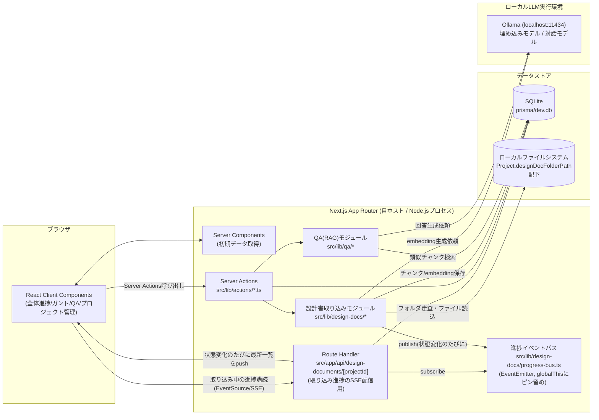
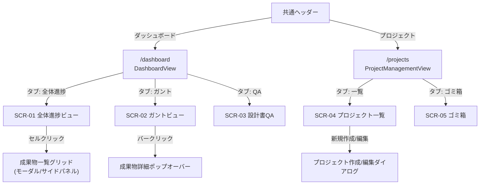
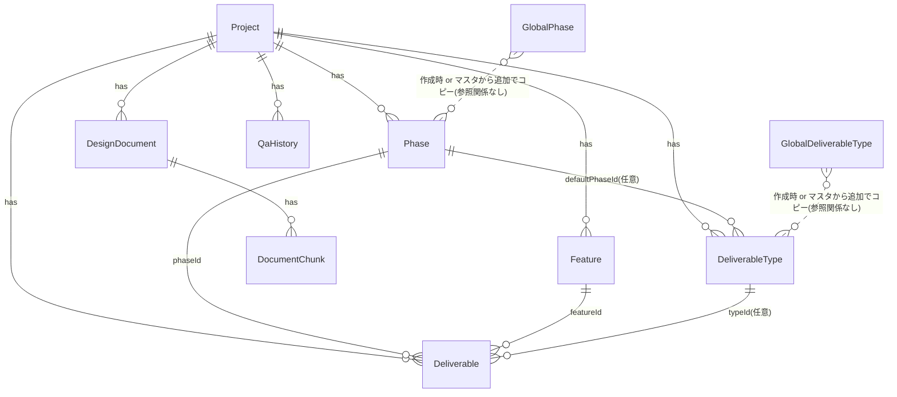
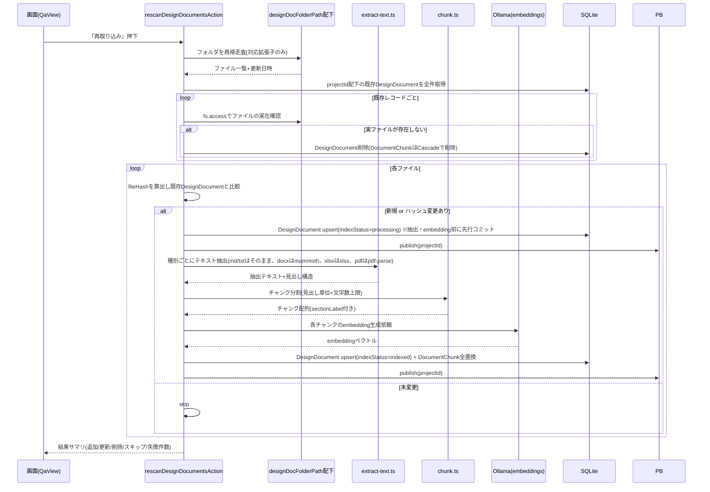
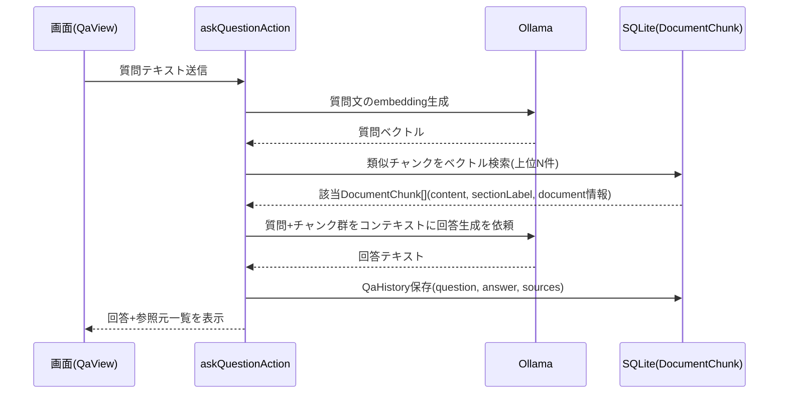

# プロジェクト進捗管理画面 基本設計書

## 0. 本書について

- 本書は [進捗ダッシュボード要件定義書](./要件定義書.md)(以下「要件定義書」)で確定した要件をもとに、実現方式・画面構成・データベース・処理フローを定義する基本設計書である。
- 実装の詳細(コンポーネント内部のstate設計、APIパラメータの厳密な型、バリデーションメッセージ文言等)は、本書をもとに作成する詳細設計書・機能仕様書に委ねる(要件定義書 10章参照)。
- 既存資産(Next.js App Router / TypeScript / Tailwind CSS / shadcn/ui / Prisma(SQLite))を踏襲するため、既存のTodo機能(`src/app/todo`, `src/lib/actions/tasks.ts` 等)の実装パターンを踏襲・再利用する方針とする。本書内では該当箇所を随所で参照する。

### 0.1 用語

要件定義書 3章の用語定義を踏襲する。加えて本書では以下を用いる。

| 用語 | 定義 |
| --- | --- |
| 集約ステータス | 全体進捗ビューのセル、およびガントビューの機能行に表示する、複数`Deliverable`の状態をまとめた表示用ステータス。DBには保持せず表示時に算出する |
| 進捗ダッシュボード | 全体進捗ビュー・スケジュール(ガント)ビュー・設計書QA機能をタブで切り替える画面群の総称(`/dashboard`配下) |

---

## 1. システム構成

### 1.1 全体アーキテクチャ



- 既存のTodo機能と同様、フロントエンドとバックエンドを分離せず、Next.js App RouterのServer Components(初期表示データ取得)とServer Actions(更新系処理)で完結させる。
- **例外**: 設計書の再取り込み中にファイル単位の進捗をリアルタイム配信する用途に限り、Server Actionではなく通常のRoute Handler(`GET /api/design-documents/[projectId]`)を使う。Next.jsは同一クライアントからのServer Action多重呼び出しを直列化するため、実行中の「再取り込み」Server Action(長時間実行)が完了するまで他のServer Action呼び出しがブロックされてしまう。Route Handler経由の`fetch`はこの制約を受けないため、実行中でも独立して進捗を取得できる(実装時に検証済み。詳細設計書 7.4節)。
- 当初は上記Route Handlerを一定間隔でポーリングする方式だったが、Ollamaのembeddingは初回(モデルロード)のみ遅く2件目以降は短時間で完了するため、ポーリング間隔より短い状態遷移を取りこぼす問題が判明した。そのため、取り込み処理側の状態変化のたびにプロセス内イベントバス(`progress-bus.ts`)へpublishし、Route HandlerがそれをSSE(Server-Sent Events)でクライアントへ即時pushする方式に変更した(詳細設計書 7.4節)。
- ローカルLLM(Ollama等)は本アプリと同一マシン上で別プロセスとして常駐させ、Next.jsサーバーからHTTP(REST)で呼び出す。外部ネットワークへの通信は行わない(要件定義書 6章「セキュリティ」に対応)。
- ベクトル検索は既存のSQLite(`prisma/dev.db`)上に構築する方針とし、`sqlite-vec`拡張(または同等の軽量ベクトル検索手段)をPrismaの`$queryRawUnsafe`経由で利用する想定とする(詳細は8章)。新規のミドルウェア(専用ベクトルDBサーバー等)は導入しない。

### 1.2 ディレクトリ構成(追加分)

既存構成([src/app/todo](../../src/app/todo), [src/lib/actions/tasks.ts](../../src/lib/actions/tasks.ts) 等)のパターンを踏襲し、以下を追加する。

```
src/
  app/
    dashboard/
      page.tsx              # 進捗ダッシュボード(タブ: 全体進捗/ガント/QA)
    projects/
      page.tsx               # プロジェクト管理画面(タブ: 一覧/ゴミ箱)
    api/
      design-documents/
        [projectId]/
          route.ts            # 設計書一覧のRoute Handler(取り込み中の進捗をSSEで配信)
  components/
    dashboard/
      dashboard-view.tsx      # タブ切替の親クライアントコンポーネント
      project-switcher.tsx    # プロジェクト切替セレクト(共通)
      add-from-master-popover.tsx # 共通マスタから追加するポップオーバー(工程・成果物種類で共用)
      deliverable-detail-dialog.tsx # 単一成果物の詳細編集ダイアログ(ガントビューから再利用)
      progress-matrix/
        progress-matrix-view.tsx
        matrix-cell.tsx
        deliverable-type-palette.tsx
        cell-detail-panel.tsx   # 一覧(リスト/グリッド)画面+詳細編集画面の2画面構成
      gantt/
        gantt-view.tsx
        gantt-row.tsx
        gantt-bar.tsx
      qa/
        qa-view.tsx
        qa-chat-panel.tsx
        qa-history-list.tsx
        qa-source-link.tsx
      types.ts                # ダッシュボード共通の型
      status.ts                # DELIVERABLE_STATUS_META等(status.tsを踏襲)
      aggregate-status.ts      # 集約ステータス算出ロジック(4.3節)
    projects/
      project-management-view.tsx
      project-form-dialog.tsx
      project-trash-tab.tsx
      global-phase-section.tsx        # 共通工程マスタ管理セクション
      global-deliverable-type-section.tsx # 共通成果物種類マスタ管理セクション
  lib/
    actions/
      projects.ts
      phases.ts                # Phase + GlobalPhase(共通工程マスタ)のCRUD
      features.ts
      deliverable-types.ts
      deliverables.ts
      design-documents.ts
      qa.ts
      pick-folder.ts           # OSのフォルダ選択ダイアログをサーバー側で起動
      reveal-file.ts           # エクスプローラーでファイルの場所を開く
    design-docs/
      scan-folder.ts           # フォルダ走査・差分検出・実ファイルが無くなったレコードの削除
      extract-text.ts          # ファイル種別ごとのテキスト抽出
      chunk.ts                 # チャンク分割
      embed.ts                 # Ollama embeddings呼び出し
      progress-bus.ts          # 取り込み進捗のプロセス内イベントバス(globalThisにピン留め)
    qa/
      retrieve.ts              # 類似チャンク検索
      generate-answer.ts       # Ollama chat呼び出し・回答組み立て
    llm/
      ollama-client.ts         # Ollama REST APIラッパー(共通)
prisma/
  schema.prisma                # 6章のモデルを追加
  seed.js                      # GlobalPhase/GlobalDeliverableTypeの初期データ投入(既存Todo用シードに追記)
```

- `pick-folder.ts`・`reveal-file.ts`は、本アプリが**ローカル1台のマシンで自ホストする**という前提(要件定義書・非機能要件)を利用し、サーバープロセスからOSのネイティブUI(PowerShell経由のFolderBrowserDialog、エクスプローラー)を直接起動する。ブラウザの標準API(File System Access API等)はセキュリティ上絶対パスを返せないため、この方式でのみ実現できる。

---

## 2. 画面一覧・画面遷移

| 画面ID | 画面名 | パス | 概要 | 要件定義書 対応節 |
| --- | --- | --- | --- | --- |
| SCR-01 | 全体進捗ビュー | `/dashboard`(タブ: 全体進捗) | 機能×工程マトリクスで進捗をサマリ表示 | 5.1 |
| SCR-02 | スケジュール(ガント)ビュー | `/dashboard`(タブ: ガント) | 成果物×日付のガントチャート | 5.2 |
| SCR-03 | 設計書QA機能 | `/dashboard`(タブ: QA) | 設計書横断チャットQA | 5.3 |
| SCR-04 | プロジェクト管理画面 | `/projects`(タブ: 一覧) | プロジェクトCRUD・共通マスタ管理 | 5.4 |
| SCR-05 | プロジェクトのゴミ箱 | `/projects`(タブ: ゴミ箱) | 論理削除プロジェクトの復元/完全削除 | 5.4 |

- SCR-01〜03は既存ヘッダーの「ダッシュボード」ナビ項目([src/components/layout/header.tsx](../../src/components/layout/header.tsx))を有効化し`/dashboard`に割り当てる。SCR-04/05はヘッダーの「プロジェクト管理」ナビ項目(`/projects`、当初ラベルは「プロジェクト」だったが本機能実装後に「プロジェクト管理」へ変更)を有効化して割り当てる(いずれも既存コード上でプレースホルダとして`active: false`かつツールチップ「近日公開予定です」で無効化済みのため、本機能実装時に有効化する)。ナビゲーションの表示順は「ダッシュボード → プロジェクト管理 → カレンダー → Todo」とする。
- Todo機能(`/todo`)とは完全に独立した画面群とし、相互のデータ参照は行わない(要件定義書 2.2 対象外)。

### 2.1 画面遷移図



---

## 3. 共通設計

### 3.1 プロジェクト切替(全ダッシュボード画面共通)

- `/dashboard`のURLクエリパラメータ`?project=<projectId>`で選択中プロジェクトを表現する(タブ切替中もクエリを保持)。
- サーバーコンポーネント(`app/dashboard/page.tsx`)は`searchParams.project`を読み、対象プロジェクトが存在し`isArchived=false`かつ`deletedAt=null`であればそれを採用。不正・未指定の場合は「作成日時が最も新しいアーカイブ外プロジェクト」にフォールバックし、`redirect()`でクエリ付きURLへ遷移する。
- プロジェクトが1件も存在しない場合は「プロジェクトがありません」という空状態を表示し、`/projects`への導線を出す。
- `ProjectSwitcher`(クライアントコンポーネント)はshadcn/uiの`Select`で構成し、選択変更時に`router.replace(`/dashboard?project=${id}&tab=${currentTab}`)`でURLを更新する(タブ状態は同様にクエリ`tab=matrix|gantt|qa`で管理し、ブラウザバック・リロードでも状態を保持する)。
- アーカイブ済みプロジェクトは`ProjectSwitcher`の選択候補から除外する(要件定義書 5.4「進捗ビュー等のプロジェクト切替候補から一時的に除外」)。

### 3.2 集約ステータス算出ロジック

全体進捗ビューのセル、およびガントビューの機能行サマリで共通利用するロジックを`src/components/dashboard/aggregate-status.ts`に集約する。

```typescript
export type DeliverableStatus =
  | "not_started" | "in_progress" | "on_hold" | "in_review" | "done";

export type CellAggregateStatus =
  | "not_applicable"      // 成果物0件
  | "partially_delayed"   // 1件以上が遅延
  | "done"                 // 全件完了
  | "not_started"          // 全件未着手
  | "in_progress";         // 上記以外(混在)

export function isDelayed(d: Pick<DeliverableLike, "status" | "plannedEndDate">, now = new Date()): boolean {
  if (d.status === "done") return false;
  if (!d.plannedEndDate) return false;
  return d.plannedEndDate.getTime() < startOfDay(now).getTime();
}

export function aggregateCellStatus(deliverables: DeliverableLike[], now = new Date()): CellAggregateStatus {
  if (deliverables.length === 0) return "not_applicable";
  if (deliverables.some((d) => isDelayed(d, now))) return "partially_delayed"; // 優先度1
  if (deliverables.every((d) => d.status === "done")) return "done";           // 優先度2
  if (deliverables.every((d) => d.status === "not_started")) return "not_started"; // 優先度3
  return "in_progress";                                                        // 優先度4
}
```

- 要件定義書 5.1節の優先順位(①一部遅延 ②完了 ③未着手 ④進行中 ⑤対象外)をそのまま関数の分岐順序として実装する。
- 遅延判定に猶予日数は設けず、「`plannedEndDate`の翌日以降」かつ「`status !== "done"`」で判定する(要件定義書 3章・9章で確定済み)。
- この関数はサーバーコンポーネント側(SSR時点の集計)・クライアント側(楽観的更新後の再計算)の両方から呼べる純粋関数とし、DBには一切保存しない(要件定義書 7章の注記どおり)。
- ガントビューの機能行サマリ「遅延N件」は`deliverables.filter(isDelayed).length`で算出する。

### 3.3 ステータス表示(色・ラベル)

既存の[src/components/todo/status.ts](../../src/components/todo/status.ts)の`STATUS_META`パターンを踏襲し、`src/components/dashboard/status.ts`に5ステータス分を定義する。

| status | label | 主な用途色 |
| --- | --- | --- |
| `not_started` | 未着手 | muted(グレー) |
| `in_progress` | 進行中 | sky(青) |
| `on_hold` | 保留 | amber(黄・既存にはない新規色) |
| `in_review` | レビュー中 | violet(紫・新規色) |
| `done` | 完了 | emerald(緑) |

集約ステータス`partially_delayed`は上記5色とは独立に赤(rose/red系)を割り当て、マトリクス・ガント双方で最優先の強調色として扱う。

### 3.4 プロジェクトの論理削除・保持期間

- 既存Todo機能の`Task.deletedAt`と同じ方式(nullable `DateTime`、フィルタ条件`deletedAt: null` / `deletedAt: { not: null }`)を`Project`にも採用する([src/lib/actions/tasks.ts](../../src/lib/actions/tasks.ts)の`softDeleteSubtree`/`restoreSubtree`/`getDeletedTasksAction`と同型のパターン)。
- `Project.name`は**論理削除中を含めて一意**という要件は、Prismaスキーマ上`name`に`@unique`制約を直接付与することで、アプリケーションコードでの重複チェックなしにDBレベルで保証する(削除済み行も物理的にテーブルに残り続けるため、`@unique`だけで要件を満たす)。作成・更新・復元の各Server Actionでは、この一意制約違反(Prismaの`P2002`エラー)を捕捉し、ユーザー向けエラーメッセージへ変換する(10章参照)。
- 30日の保持期間は「表示上の残り日数計算」のみに用い、自動物理削除のバッチ処理は実装しない(要件定義書 5.4「保持期間経過後の自動物理削除は行わない」)。保持期限切れの判定・警告表示はUI側で`deletedAt + 30日 < now`かどうかを計算して行う。
- 完全削除(物理削除)は`onDelete: Cascade`で関連する`Phase`/`Feature`/`DeliverableType`/`Deliverable`/`DesignDocument`(→`DocumentChunk`)/`QaHistory`を連鎖削除する(6章のスキーマ参照)。

---

## 4. 画面設計

### 4.1 SCR-01 全体進捗ビュー

**構成コンポーネント**: `ProgressMatrixView`(クライアント)

```
┌─────────────────────────────────────────────────────────────┐
│ プロジェクト: [発注管理システム ▾]   全体完了率: 42% (21/50)   │
├─────────────────────────────────────────────────────────────┤
│ 成果物種類パレット: [基本設計書][詳細設計書][画面設計書]…(横スクロール) │
├─────────────────────────────────────────────────────────────┤
│           │要件定義   │基本設計    │詳細設計   │実装 │テスト │
│           │12/12完了  │8/20 (40%)  │0/10       │ -   │ -    │
├───────────┼───────────┼────────────┼───────────┼─────┼──────┤
│ 発注機能   │✅完了(1/1)│🔴一部遅延  │⬜未着手   │ -   │ -    │  ← ドロップ先セル
│ 会員機能   │✅完了(1/1)│✅完了(3/3) │🔵進行中   │ -   │ -    │
│ 在庫管理機能│🔵進行中   │⬜未着手    │ -         │ -   │ -    │
└─────────────────────────────────────────────────────────────┘
```

セルクリックで開く`CellDetailPanel`は、実装時に「一覧画面(リスト/グリッド切替可)→項目クリックで詳細編集画面」の2画面構成に整理した(詳細は機能仕様書 2.5節)。

**データ取得**:
- `app/dashboard/page.tsx`(タブ`matrix`)で、選択中`projectId`に紐づく`Phase[]`・`Feature[]`・`Deliverable[]`(`DeliverableType`をinclude)を一括取得し、`ProgressMatrixView`にpropsとして渡す(SSR時点で初期描画、以降はServer Actionsの戻り値で状態更新する。既存`getFreshTree`パターンを踏襲)。
- セル集約ステータス・工程別完了率・全体完了率はすべてクライアント側で3.2節の関数を用いて算出する(サーバー側では生データのみ返す)。

**主な操作とServer Actionsの対応**:

| 操作 | 呼び出すAction | 補足 |
| --- | --- | --- |
| セルクリック→詳細パネル表示 | (Action呼び出しなし。取得済みデータをクライアント側でfilter) | `featureId`+`phaseId`で絞り込み |
| パレットからD&Dでドロップ | `createDeliverableFromDropAction(featureId, phaseId, typeId)` | 5.1節参照。名称初期値「機能名+種類名」、status="not_started" |
| パレットの想定工程とドロップ先工程列が不一致 | (クライアント側で警告表示のみ、Actionは呼ぶが確認は事前) | `DeliverableType.defaultPhaseId`と比較。警告はconfirm型トースト、続行/中止を選択 |
| 同一セルへの同一種類再ドロップ | ドロップ前に確認ダイアログ→OKで`createDeliverableFromDropAction`呼び出し | 事前にクライアント側で同一`typeId`の存在を確認 |
| キーボード操作代替(プルダウン追加) | セル詳細パネル内の`Select`から種類選択→`createDeliverableFromDropAction` | D&D不可環境向けのアクセシビリティ対応 |
| 一覧項目クリック→詳細編集画面へ遷移 | (Action呼び出しなし) | `CellDetailPanel`内のstateで一覧/詳細を切替(機能仕様書 2.5節) |
| 詳細編集画面でステータス変更・編集・削除 | `updateDeliverableAction` / `deleteDeliverableAction` | 3.2節ロジックで再集計しUI即時反映。削除は物理削除(`Deliverable`自体は要件定義書上ゴミ箱対象外のため確認ダイアログのみで即時削除) |
| 機能/工程/成果物種類マスタの追加・編集・削除 | `phases.ts` / `features.ts` / `deliverable-types.ts` 各Action | 削除不可制約は4.4節参照 |

**D&D実装方針**: `dnd-kit`(`@dnd-kit/core`)を新規依存として追加する(要件定義書 8章の提案どおり)。パレット項目を`useDraggable`、マトリクスセルを`useDroppable`として実装し、ドロップ時にoptimistic UIで即時反映後、Server Action結果で確定させる。

### 4.2 SCR-02 スケジュール(ガントビュー)

**構成コンポーネント**: `GanttView`

```
┌───────────────────────────────────────────────────────────┐
│ 表示単位: [週|月]  ◀ 2026年6月 ▶ [今日]  機能:[全て▾] 工程:[全て▾] │
├───────────────────────────────────────────────────────────┤
│                    │      2026/6           │ ← 1段目: 月
│                    │ 1  2  3 ... 29 30      │ ← 2段目: 日
│ ▶ 発注機能(遅延2件) │ ████████░░░░░░░░░░░░░░░ │  ← 折りたたみ済(初期表示)
│ ▶ 会員機能          │      ██████░░░░░░░░░░░  │
│ ▼ 在庫管理機能       │                          │  ← クリックで展開
│    在庫管理 基本設計書│      ████░░░░░░░       │
│    在庫管理 画面設計書│         ██████░░░░░░   │  ← 実績バー重ね表示、遅延は赤強調
└───────────────────────────────────────────────────────────┘
```

- 縦軸: `Feature`単位でグルーピングし、初期状態は機能行(折りたたみ)のみ表示。機能行クリックで配下`Deliverable`行を展開(クライアントの開閉state、`Set<featureId>`で管理。ページ遷移では保持しない)。
- 機能行のサマリ表示「遅延N件」は3.2節の`isDelayed`をfeature配下の全`Deliverable`に適用してカウント。
- バー描画: 予定期間(`plannedStartDate`〜`plannedEndDate`)を背景バー、実績(`actualStartDate`〜`actualEndDate`、未完了時は`progress`%で塗りつぶし)を前景バーとして重ねる。既存UIライブラリ(shadcn/ui)には無いため、Tailwindのgridで日付列を敷き、バーはabsolute配置のdivで自前実装する(要件定義書 8章の方針どおり)。
- 横軸は2段のヘッダー行で構成する(1段目: 月、2段目: 日)。表示単位(週/月)は「直近1週間のみ」「直近1か月のみ」を表示する固定ウィンドウとし、前後にページングして表示範囲を移動する(実装時に四半期表示は削除し、週/月とも日単位の目盛りに統一した。詳細設計書 4.5節)。
- 表示範囲(ページ)は`anchor`(基準日、既定は本日)で管理し、「◀/▶」ボタンで週表示は7日、月表示は暦月単位でずらす。「今日」ボタンで`anchor`を本日にリセットする。表示範囲外に予定日がかかる成果物バーは、行コンテナに`overflow: hidden`を適用して表示範囲の境界で切り取る(範囲外のバーを描画しないための特別な分岐は設けず、CSSのクリッピングのみで実現する)。
- 機能・工程フィルタはクライアント側の配列フィルタで実装(取得済みデータに対して絞り込み。再フェッチ不要)。
- バークリックで4.1節の成果物詳細編集画面(`DeliverableDetailDialog`、`CellDetailPanel`の詳細編集画面を再利用)を開き、その場でステータス・担当者・日付・進捗・メモ・リンクを編集できる(機能仕様書 3.3節)。
- 機能行は`dnd-kit`(`@dnd-kit/core`+`@dnd-kit/sortable`)でドラッグ&ドロップ並び替えできる。ドラッグハンドル(常時表示、Todoの並び替えハンドルと同じ方針)をつまんで移動し、`reorderFeaturesAction`で`Feature.order`を更新する(6.2節)。`Feature.order`はマトリクス行の並び順にも使われる共有フィールドのため、ガントビューで並び替えるとマトリクス表側の表示順にも反映される(次回表示・再読み込み時に反映。互いのタブは独立したstateコピーを持つため、タブを切り替えずに即座には反映されない。0.2節の「プロジェクト切替時の`key`」と同種の制約)。
- 横軸の月・日ラベルは、`<th>`のデフォルトの中央寄せを明示的に`text-left`で上書きして左揃えにする(バーの左端がどの日から始まっているかを目視で数えやすくするための対応)。

### 4.3 SCR-03 設計書QA機能

**構成コンポーネント**: `QaView`(左: チャットパネル、右: 履歴一覧 or 上下分割)

```
┌───────────────────────────────────────────────────────┐
│ [ ⟳ 再取り込み ]  最終取り込み: 2026-09-05 10:20        │
│ ⚠ 未取り込みの設計書が2件あります                        │
├───────────────────────────────────────────────────────┤
│ Q: 発注機能の在庫連携APIの認証方式は?                     │
│ A: APIキー方式を採用しています。トークンの有効期限は…      │
│    参照元: [発注機能 API仕様書 > 3.認証] [発注機能 基本設計書 > 5.2]│
├───────────────────────────────────────────────────────┤
│ [ 質問を入力…                                    ] [送信] │
├───────────────────────────────────────────────────────┤
│ 履歴: ・在庫連携APIの認証方式は?(9/5)  ・…               │
└───────────────────────────────────────────────────────┘
```

**主な操作とServer Actionsの対応**:

| 操作 | 呼び出すAction | 補足 |
| --- | --- | --- |
| 画面表示時 | `listDesignDocumentsAction(projectId)` | インデックス状態(`indexStatus`)から未取り込み件数を算出し警告表示 |
| 「再取り込み」押下 | `rescanDesignDocumentsAction(projectId)` | 8章の取り込み処理。実行中はボタンを`disabled`+スピナー表示 |
| 質問送信 | `askQuestionAction(projectId, question)` | 8.3節のRAGフロー。生成中はローディング表示(要件定義書 6章「可用性」) |
| 参照元クリック | (Action呼び出しなし) | `DocumentChunk.sectionLabel`と`DesignDocument.filePath`から該当箇所を新規タブ/プレビューで開く。詳細は詳細設計で確定(対応拡張子ごとに「該当箇所へのリンク」実現方式が異なるため) |
| 履歴一覧表示・再表示 | `listQaHistoryAction(projectId)` | クリックで過去の質問・回答・参照元をチャットパネルに再表示 |
| 質問履歴クリア | `clearQaHistoryAction(projectId)` | `AlertDialog`で確認後に実行。プロジェクトの`QaHistory`を全件削除する |

- 回答生成は同一Server Actionの中で「類似チャンク検索→LLM呼び出し→`QaHistory`保存→結果返却」まで同期的に行う(自ホスト運用のためサーバーレスのタイムアウト制約は想定しない。数秒〜数十秒はクライアント側のローディングUIで許容する)。
- 参照している設計書一覧は、`designDocFolderPath`からの相対パスをもとにフォルダ階層のツリーとして描画する(フォルダ名の見出し行+配下ファイルのインデント)。DBは階層を持たず`filePath`(絶対パス)のみを保持しているため、ツリー構造はクライアント側で`filePath`から都度構築する(機能仕様書 4.2節)。
- 履歴一覧の項目クリックはAction呼び出しを伴わない。チャット本文側に描画済みの対応するメッセージ要素への参照を保持しておき、`scrollIntoView`でスクロールしたうえで一時的にハイライト表示する(クライアントのみの処理。詳細設計書 4.6節)。

### 4.4 SCR-04/05 プロジェクト管理画面

**構成コンポーネント**: `ProjectManagementView`(shadcn/uiの`Tabs`で「一覧」「ゴミ箱」を切替。要件定義書 5.4「独立画面ではなくタブ」に対応)

```
┌───────────────────────────────────────────────────────┐
│ [ プロジェクト一覧 ] [ ゴミ箱 ]         [+ 新規プロジェクト] │
├───────────────────────────────────────────────────────┤
│ 名前          | 作成日     | 設計書フォルダ       | 状態  │
│ 発注管理SYS    | 2026-06-01 | C:\docs\proj-a       | 稼働中 │
│ 旧受発注SYS    | 2025-01-10 | C:\docs\proj-old     | アーカイブ │
├───────────────────────────────────────────────────────┤
│ 共通工程マスタ(GlobalPhase)   │ 共通成果物種類マスタ(GlobalDeliverableType)│
│ [要件定義][基本設計]…[+ 追加] │ [基本設計書][詳細設計書]…[+ 追加]          │
└───────────────────────────────────────────────────────┘
```

プロジェクト作成/編集フォームの設計書フォルダパス欄には、直接入力に加えて「参照...」ボタンを設け、`pickFolderAction`でOSのフォルダ選択ダイアログを起動できるようにした(6.1節)。

ゴミ箱タブ:
```
┌───────────────────────────────────────────────────────┐
│ 名前          | 削除日     | 残り保持日数 | [復元][完全削除]│
│ 旧テスト案件PJ | 2026-08-20 | 残り13日     |                 │
└───────────────────────────────────────────────────────┘
```

**主な操作とServer Actionsの対応**:

| 操作 | 呼び出すAction | 補足 |
| --- | --- | --- |
| 一覧表示 | `listProjectsAction()` | `deletedAt: null`のプロジェクトを取得 |
| 新規作成 | `createProjectAction({ name, designDocFolderPath })` | `GlobalPhase`全件を`Phase`へ、`GlobalDeliverableType`全件を`DeliverableType`へコピー(`defaultPhaseId`も自動解決)。名称重複は3.4節のDB制約違反をハンドリング |
| 編集 | `updateProjectAction(id, { name?, designDocFolderPath? })` | 同上の重複チェック |
| フォルダ選択ダイアログ起動 | `pickFolderAction(initialPath?)` | OSのフォルダ選択ダイアログを起動し選択結果をフォームに反映(6.1節) |
| アーカイブ/解除 | `archiveProjectAction(id)` / `unarchiveProjectAction(id)` | `isArchived`をtoggle。切替候補から除外/復帰 |
| 削除(論理削除) | `softDeleteProjectAction(id)` | 確認ダイアログ後に実行。`deletedAt`セット |
| ゴミ箱一覧 | `listTrashedProjectsAction()` | `deletedAt: { not: null }`。残り日数を計算して返す |
| 復元 | `restoreProjectAction(id)` | `deletedAt: null`に戻す。DB制約により、現存する同名プロジェクトがあれば一意制約違反エラーとなる(要件どおり自動的に再チェックされる) |
| 完全削除 | `permanentlyDeleteProjectAction(id)` | 確認ダイアログ後、`prisma.project.delete`(Cascadeで関連データも削除) |
| 共通マスタCRUD | `phases.ts`/`deliverable-types.ts`内の`Global*Action`群 | 既存プロジェクトの`Phase`/`DeliverableType`には影響しない(コピーのみで参照関係を持たない設計。6章参照) |
| マスタから追加(全体進捗ビュー側) | `addGlobalPhasesToProjectAction` / `addGlobalDeliverableTypesToProjectAction` | 既存プロジェクトへ共通マスタの項目を後から個別に取り込む(6.2節・6.3節) |

---

## 5. データベース設計

### 5.1 ER図



### 5.2 Prismaスキーマ(追加分ドラフト)

既存の`Task`モデル([prisma/schema.prisma](../../prisma/schema.prisma))の記法(`cuid()`、論理削除、`@@index`)を踏襲する。

```prisma
model Project {
  id                  String    @id @default(cuid())
  name                String    @unique
  designDocFolderPath String
  isArchived          Boolean   @default(false)
  deletedAt           DateTime?
  createdAt           DateTime  @default(now())
  updatedAt           DateTime  @updatedAt

  phases           Phase[]
  features         Feature[]
  deliverableTypes DeliverableType[]
  deliverables     Deliverable[]
  designDocuments  DesignDocument[]
  qaHistories      QaHistory[]

  @@index([deletedAt])
  @@index([isArchived])
}

model Phase {
  id        String   @id @default(cuid())
  projectId String
  project   Project  @relation(fields: [projectId], references: [id], onDelete: Cascade)
  name      String
  order     Int      @default(0)
  createdAt DateTime @default(now())
  updatedAt DateTime @updatedAt

  deliverableTypes DeliverableType[]
  deliverables     Deliverable[]

  @@index([projectId])
}

model Feature {
  id        String   @id @default(cuid())
  projectId String
  project   Project  @relation(fields: [projectId], references: [id], onDelete: Cascade)
  name      String
  order     Int      @default(0)
  createdAt DateTime @default(now())
  updatedAt DateTime @updatedAt

  deliverables Deliverable[]

  @@index([projectId])
}

// 全プロジェクト共通のひな形マスタ(projectIdを持たない)
model GlobalPhase {
  id        String   @id @default(cuid())
  name      String
  order     Int      @default(0)
  createdAt DateTime @default(now())
  updatedAt DateTime @updatedAt
}

model GlobalDeliverableType {
  id               String   @id @default(cuid())
  name             String
  defaultPhaseName String
  order            Int      @default(0)
  createdAt        DateTime @default(now())
  updatedAt        DateTime @updatedAt
}

model DeliverableType {
  id             String   @id @default(cuid())
  projectId      String
  project        Project  @relation(fields: [projectId], references: [id], onDelete: Cascade)
  name           String
  defaultPhaseId String?
  defaultPhase   Phase?   @relation(fields: [defaultPhaseId], references: [id], onDelete: SetNull)
  order          Int      @default(0)
  createdAt      DateTime @default(now())
  updatedAt      DateTime @updatedAt

  deliverables Deliverable[]

  @@index([projectId])
}

model Deliverable {
  id        String  @id @default(cuid())
  projectId String
  project   Project @relation(fields: [projectId], references: [id], onDelete: Cascade)
  featureId String
  feature   Feature @relation(fields: [featureId], references: [id], onDelete: Cascade)
  phaseId   String
  phase     Phase   @relation(fields: [phaseId], references: [id], onDelete: Cascade)
  typeId    String?
  type      DeliverableType? @relation(fields: [typeId], references: [id], onDelete: SetNull)

  name             String
  assignee         String    @default("")
  link             String    @default("")
  status           String    @default("not_started") // not_started/in_progress/on_hold/in_review/done
  plannedStartDate DateTime?
  plannedEndDate   DateTime?
  actualStartDate  DateTime?
  actualEndDate    DateTime?
  progress         Int       @default(0)
  memo             String    @default("")
  order            Int       @default(0)
  createdAt        DateTime  @default(now())
  updatedAt        DateTime  @updatedAt

  @@index([projectId])
  @@index([featureId, phaseId])
  @@index([typeId])
}

model DesignDocument {
  id          String    @id @default(cuid())
  projectId   String
  project     Project   @relation(fields: [projectId], references: [id], onDelete: Cascade)
  title       String
  filePath    String
  fileHash    String
  indexStatus String    @default("pending") // pending/processing/indexed/failed
  indexedAt   DateTime?
  createdAt   DateTime  @default(now())
  updatedAt   DateTime  @updatedAt

  chunks DocumentChunk[]

  @@unique([projectId, filePath])
  @@index([projectId])
}

model DocumentChunk {
  id           String         @id @default(cuid())
  documentId   String
  document     DesignDocument @relation(fields: [documentId], references: [id], onDelete: Cascade)
  chunkIndex   Int
  content      String
  sectionLabel String
  embedding    Bytes
  createdAt    DateTime       @default(now())

  @@index([documentId])
}

model QaHistory {
  id        String   @id @default(cuid())
  projectId String
  project   Project  @relation(fields: [projectId], references: [id], onDelete: Cascade)
  question  String
  answer    String
  sources   String   // JSON文字列(参照元一覧)。既存Task.tagsのシリアライズ方式踏襲
  createdAt DateTime @default(now())

  @@index([projectId])
}
```

**要件定義書 7章のデータモデルからの追加・変更点(基本設計での補足)**:

| モデル | 追加・変更 | 理由 |
| --- | --- | --- |
| `Project.name` | `@unique`制約を付与 | 3.4節のとおり、論理削除行を含めた一意性をDBレベルで保証するため |
| `DesignDocument.fileHash` | 追加 | 「再取り込み」時に未取り込み・更新ファイルを差分検出するため(要件定義書 5.3「新規・更新ファイルを検出」に対応する実装手段) |
| `DesignDocument.indexStatus` / `indexedAt` | 追加。`indexStatus`は当初`pending`/`indexed`/`failed`の3値だったが、**再取り込み中の進捗をファイル単位で確認できるようにするため`processing`を追加**し4値とした | 「未取り込み/インデックス未反映の設計書」の警告表示、および取り込み中のリアルタイム進捗表示(要件定義書 5.3)を実現するため |
| `DocumentChunk.chunkIndex` | 追加 | 同一文書内チャンクの順序保持(参照元表示・再構成のため) |
| `Deliverable.status`のとりうる値 | `not_started`/`in_progress`/`on_hold`/`in_review`/`done`の5種と明記 | 要件定義書 3章のステータス定義に対応 |
| `Deliverable.link` | 追加(`String @default("")`) | 成果物に参照先URLを1件登録できるようにするため(要件定義書 5.1節) |
| `GlobalPhase` | 追加(`GlobalDeliverableType`と対になる工程版の共通マスタ) | 工程についても成果物種類と同様に、全プロジェクト共通のひな形を管理できるようにするため(要件定義書 5.4節) |

### 5.3 インデックス方針

- `Deliverable`は全体進捗ビュー(`featureId`+`phaseId`でグルーピング)・ガントビュー(`projectId`+機能単位)の両方から高頻度に参照されるため、複合インデックス`[featureId, phaseId]`を付与する。
- `DocumentChunk`のベクトル検索については、8.4節の方針(`sqlite-vec`等の拡張)に従い、埋め込み専用の仮想テーブル(`vec0`等)を別途作成しANN検索を行う想定とする。Prismaのスキーマ管理外(生SQLマイグレーション)で追加することを許容する。

---

## 6. Server Actions設計

既存[src/lib/actions/tasks.ts](../../src/lib/actions/tasks.ts)の実装パターン(`"use server"`、更新後に`revalidatePath`し最新データを返す、論理削除はサブツリー再帰ではなく単純フラグ更新)を踏襲する。

### 6.1 `src/lib/actions/projects.ts`

| 関数 | 入力 | 出力 | 概要 |
| --- | --- | --- | --- |
| `listProjectsAction` | - | `Project[]` | `deletedAt: null`一覧(アーカイブ含む) |
| `listSwitchableProjectsAction` | - | `Pick<Project, "id"\|"name">[]` | `deletedAt: null` かつ `isArchived: false` |
| `createProjectAction` | `{ name, designDocFolderPath }` | `Project` | `GlobalPhase`を`Phase`へ、`GlobalDeliverableType`を`DeliverableType`へ初期コピー(`Phase`コピー後に`defaultPhaseName`と一致する`Phase`があれば`defaultPhaseId`を自動解決)。一意制約違反時はアプリ側エラー型で返却 |
| `pickFolderAction`(`src/lib/actions/pick-folder.ts`) | `initialPath?: string \| null` | `string \| null` | サーバー側でPowerShell経由のOS `FolderBrowserDialog`を起動し選択結果を返す(Windows専用)。初期表示パスは、指定されて実在すればそれを使用し、そうでなければOSの「ドキュメント」フォルダにフォールバックする |
| `updateProjectAction` | `id, { name?, designDocFolderPath? }` | `Project` | 同上のエラーハンドリング |
| `archiveProjectAction` / `unarchiveProjectAction` | `id` | `Project` | `isArchived`更新 |
| `softDeleteProjectAction` | `id` | `Project[]`(更新後一覧) | `deletedAt`セット |
| `listTrashedProjectsAction` | - | `TrashedProjectSummary[]`(残り日数を含む) | `deletedAt: { not: null }` |
| `restoreProjectAction` | `id` | `{ projects, trashed }` | `deletedAt: null`。一意制約違反時はエラー |
| `permanentlyDeleteProjectAction` | `id` | `{ trashed }` | Cascade削除 |

### 6.2 `src/lib/actions/phases.ts` / `features.ts`

| 関数 | 概要 |
| --- | --- |
| `createPhaseAction` / `createFeatureAction` | `projectId, name`で作成。`order`は既存件数から算出(既存`nextOrder`パターン踏襲) |
| `updatePhaseAction` / `updateFeatureAction` | `name`・`order`更新 |
| `deletePhaseAction` / `deleteFeatureAction` | 物理削除(Cascadeで配下`Deliverable`も削除される点を削除確認ダイアログで明示) |
| `reorderFeaturesAction(projectId, orderedIds)` | ガントビューの機能行ドラッグ&ドロップ並び替え用(4.2節)。`orderedIds`の並び順どおりに`order`を0始まりで振り直す。全体進捗ビューのマトリクス行順にも反映される(共有の`order`フィールドのため) |
| `listGlobalPhasesAction` / `createGlobalPhaseAction` / `updateGlobalPhaseAction` / `deleteGlobalPhaseAction`(`phases.ts`に同居) | 共通工程マスタ(`GlobalPhase`)CRUD。既存プロジェクトへの遡及影響なし |
| `addGlobalPhasesToProjectAction` | `projectId, globalPhaseIds[]` → 対象の`GlobalPhase`のうち、同名の`Phase`が当該プロジェクトに未存在のものだけを`Phase`として追加(既存分はスキップ) |

### 6.3 `src/lib/actions/deliverable-types.ts`

| 関数 | 概要 |
| --- | --- |
| `listGlobalDeliverableTypesAction` / `createGlobalDeliverableTypeAction` / `updateGlobalDeliverableTypeAction` / `deleteGlobalDeliverableTypeAction` | 共通マスタCRUD。既存プロジェクトへの遡及影響なし |
| `createDeliverableTypeAction` / `updateDeliverableTypeAction` | プロジェクト固有マスタCRUD |
| `deleteDeliverableTypeAction` | 削除前に`prisma.deliverable.count({ where: { typeId } })`を確認し、1件以上あれば`{ ok: false, count }`を返す(4.4節「◯件あるため削除できません」に対応) |
| `addGlobalDeliverableTypesToProjectAction` | `projectId, globalTypeIds[]` → 対象の`GlobalDeliverableType`のうち同名の`DeliverableType`が未存在のものだけを追加。`defaultPhaseName`と一致する`Phase`があれば`defaultPhaseId`を自動解決 |

### 6.4 `src/lib/actions/deliverables.ts`

| 関数 | 概要 |
| --- | --- |
| `createDeliverableFromDropAction` | `featureId, phaseId, typeId`から`name`初期値を組み立てて作成。既存の同一`typeId`存在確認はクライアント側で行い、確認ダイアログ通過後に呼び出す |
| `updateDeliverableAction` | ステータス・担当者・**リンク(URL)**・日付・メモ等の更新。既存`updateTaskAction`同様、`status`変更時の`progress`自動補正(例: `done`→100%)を検討可(詳細設計で確定) |
| `deleteDeliverableAction` | 確認ダイアログ後に物理削除 |

### 6.5 `src/lib/actions/design-documents.ts` / `src/lib/actions/reveal-file.ts`

| 関数 | 概要 |
| --- | --- |
| `listDesignDocumentsAction` | `projectId`配下の`DesignDocument`一覧と`indexStatus`集計(未反映件数)を返す |
| `rescanDesignDocumentsAction` | 8.2節のフォルダ走査〜embedding保存までを同期実行し、結果サマリ(`{ added, updated, skipped, failed, removed }`)を返す。`removed`は実ファイルが無くなり削除したレコード数(7.1節) |
| `getDesignDocumentChunksAction` | `documentId` → タイトル・ファイルパス・`indexStatus`・セクションごとの抽出内容(`DocumentChunk`)を返す。設計書一覧からの内容確認に使う |
| `revealFileAction`(`reveal-file.ts`) | `filePath` → サーバー側で`explorer.exe /select,<path>`を起動し、エクスプローラーでファイルの場所を開く(Windows専用。1.2節の「ローカル1台構成」の前提を利用) |

**取り込み中の進捗配信について**: `listDesignDocumentsAction`と同じ内容を返す`GET /api/design-documents/[projectId]`というRoute HandlerをSSE(Server-Sent Events)として別途用意している。クライアントは再取り込み実行中、Server Actionの`listDesignDocumentsAction`ではなくこのRoute Handlerに`EventSource`で接続し、設計書取り込みモジュール側の状態変化のたびにpushされる最新一覧を受け取る(1.1節・7.4節参照)。

### 6.6 `src/lib/actions/qa.ts`

| 関数 | 概要 |
| --- | --- |
| `listQaHistoryAction` | `projectId`の`QaHistory`を新しい順に取得 |
| `askQuestionAction` | 8.3節のRAGフローを実行し、回答と参照元リストを返却。`QaHistory`へ保存 |
| `clearQaHistoryAction` | `projectId`の`QaHistory`を全件削除する(`deleteMany`)。復元手段は設けない(4.3節) |

---

## 7. 設計書QA(ローカルLLM/RAG)サブシステム設計

### 7.1 取り込み(インデックス化)処理フロー



- 対応形式ごとの抽出ライブラリは要件定義書 8章の想定(`mammoth`/`xlsx`/`pdf-parse`)を踏襲。画像形式は対象外(スキャン時点で拡張子フィルタにより除外)。
- 1ファイルの抽出・embedding失敗は`indexStatus=failed`として記録し、処理全体は継続する(一部ファイル失敗で全体停止しない)。
- 再取り込みは要件定義書のとおり手動トリガーのみ。フォルダの自動監視(ファイル監視API等)は実装しない。
- **実ファイルが無くなったレコードの削除**: 当初はフォルダ走査で見つからなくなった`DesignDocument`を削除しない方針だったが、ドキュメントをフォルダ移動・リネームした際に旧パスのレコードが残り続け、「参照している設計書」件数が実際のファイル数と乖離する不具合が判明したため、既存レコードごとに実ファイルの存在を確認し、無ければ削除する処理を追加した(7章末尾の残課題、詳細設計書 3.5節)。走査自体が一部のサブフォルダで失敗した場合(基本設計書外の実装補足)に実在ファイルを誤削除しないよう、走査結果(`targetFiles`)との突き合わせではなく`fs.access`による個別の実在確認を行う。
- **`indexStatus=processing`の先行書き込み**は、7.4節のリアルタイム進捗配信でファイル単位の進捗(「更新中」→「取込済」)をクライアントに反映するために導入した(抽出・embedding自体はファイルごとに数秒〜数十秒かかるため、この中間状態がないと画面上は長時間「何も変わらない」ように見えてしまう)。状態が変化するたび(`processing`書き込み時・`indexed`/`failed`確定時・レコード削除時)に進捗イベントバス(`progress-bus.ts`)へpublishする。

### 7.2 質問応答(RAG)処理フロー



- 参照元は検索でヒットした`DocumentChunk`から一意な`(DesignDocument.title, sectionLabel)`の組を抽出して提示する。
- 回答生成中は`askQuestionAction`呼び出し中であることをクライアント側(`useTransition`の`isPending`)でローディング表示する。

### 7.3 モデル・ミドルウェア選定方針

- 実行基盤: Ollama(ローカルHTTP API、`localhost:11434`)を想定。Next.jsサーバーからは`src/lib/llm/ollama-client.ts`経由でHTTP fetchする薄いラッパーのみを持ち、モデル差し替えが容易な構成とする。
- 対話モデル・embeddingモデルの具体的な採用モデル(パラメータ数・量子化レベル)は、要件定義書 9章のとおり実装フェーズでのリサーチ・検証事項とし、本書では「CPU推論可能・GPUなし/RAM8GBで実用的な応答時間」という制約のみを設計要件として固定する。
- ベクトル検索: SQLite構成を維持する方針(要件定義書 8章)に従い、`sqlite-vec`拡張の導入を第一候補とする。導入が困難な場合の代替として、`DocumentChunk`件数が非機能要件の想定規模(数十〜百件オーダーの成果物に付随する設計書群)である限り、全件をメモリ上でコサイン類似度計算するフォールバック実装も許容する(詳細設計で確定)。

### 7.4 取り込み中のリアルタイム進捗配信設計(実装時に確定した方式)

再取り込み中、設計書一覧をファイル単位でリアルタイム更新するにあたり、当初は`listDesignDocumentsAction`(Server Action)を`setInterval`で定期呼び出しするポーリングを想定していた。しかし実装・検証の結果、**Next.jsは同一クライアントからのServer Action呼び出しを直列化する**ため、実行中の`rescanDesignDocumentsAction`(長時間実行、数十秒規模)が完了するまでポーリング用のServer Action自体が一切送信されないことが判明した(ネットワークログで実証済み: 再取り込み中、ポーリング用リクエストは1件も発火せず、再取り込み完了と同時にまとめて発火した)。

この制約を回避するため、ポーリング専用に**通常のRoute Handler**(`GET /api/design-documents/[projectId]`、中身は`listDesignDocumentsAction`と同じ`prisma`問い合わせ)を新設し、クライアントは`fetch()`でこれを1秒間隔で呼び出す方式に変更した。Route Handler経由の`fetch`はServer Actionの直列化キューを経由しないため、実行中の`rescanDesignDocumentsAction`と並行して独立に進捗を取得できる。

**設計原則**: 「更新系の重い処理と並行してポーリングしたい」ケースでは、ポーリング対象をServer Actionではなく Route Handler として実装する。Server Actionは単発の更新操作(ユーザー操作に対する応答)には適するが、別の実行中アクションと並行して呼び出す必要がある読み取り専用のポーリング用途には不向きである。

**追加の改善: ポーリングからSSE(Server-Sent Events)への変更**

上記のRoute Handlerを1秒間隔でポーリングする方式は稼働後、「複数ファイルを再取り込みすると、最初の1件目しか『更新中』表示にならない」という不具合として顕在化した。原因はOllamaのembedding呼び出しの特性にある: 1件目はモデルのロードが伴うため`processing`状態が数秒〜数十秒続くが、2件目以降はモデルがロード済みのため`processing`状態が1秒未満で`indexed`に遷移してしまうことが多く、1秒間隔のポーリングでは観測できないタイミングが生じる(サーバー側のDBは正しく状態遷移しているが、クライアントが取りこぼす)。

そのため、以下の構成に変更した。

1. `src/lib/design-docs/progress-bus.ts`に、Node.jsの`EventEmitter`をプロジェクトID単位のトピックとして使う簡易なプロセス内イベントバスを実装する(`publishDesignDocProgress(projectId)` / `subscribeDesignDocProgress(projectId, listener)`)。
2. `scanAndIndex`(取り込みモジュール)は、`DesignDocument`の`indexStatus`が変化するたび(`processing`書き込み時、`indexed`/`failed`確定時、実ファイルが無くなったレコードの削除時)にこのバスへpublishする。
3. Route Handler(`GET /api/design-documents/[projectId]`)は、`fetch`に対して`text/event-stream`のレスポンス(`ReadableStream`)を返すSSEエンドポイントに変更する。接続直後に現在の一覧を1回送信したうえで、このバスをsubscribeし、状態変化のイベントを受け取るたびに最新の一覧を再取得してpushする。
4. クライアント(`QaView`)は、再取り込み開始時に`setInterval`のポーリングではなく`new EventSource(...)`で接続し、`onmessage`で受け取った一覧を`setDocuments`する。再取り込み完了時に`eventSource.close()`する。

この方式なら、DB上で状態が変化した「その瞬間」にクライアントへpushされるため、処理時間の長短にかかわらず全ての遷移を確実に反映できる。

**実装上の注意(モジュールインスタンスの重複)**: `progress-bus.ts`のイベントバスを単純にモジュール直下の変数として実装したところ、Route Handler側(`subscribe`)とServer Action側(`scanAndIndex`からの`publish`)で別々の`EventEmitter`インスタンスが生成され、イベントが一切届かない不具合が発生した。原因は、Next.jsの開発サーバーがRoute HandlerとServer Action/RSCを別のモジュールグラフとしてロードすることがあり、同一プロセス内でもモジュールの初期化がそれぞれ独立して走ってしまうため。この問題は[prisma.ts](../../src/lib/prisma.ts)のPrismaClientシングルトンと同種の事象であり、同じ対処(`globalThis`にインスタンスをぶら下げてプロセス全体で共有する)で解決した(詳細設計書 3.7節)。

---

## 8. 非機能要件への対応方針

要件定義書 6章の各項目に対する設計上の対応を以下に整理する。

| 分類 | 要件 | 本書での対応 |
| --- | --- | --- |
| セキュリティ | 外部APIへのデータ送信を行わない | 7章のとおりLLM呼び出しは同一マシン上のOllamaのみ。外部SaaS型LLM APIへの依存を持たない構成とする |
| 性能 | 進捗ビュー・ガントビューは数十〜百件規模でストレスなく表示 | 集約ステータス計算(3.2節)はO(件数)の単純な配列走査に留め、サーバー側は生データ取得のみでロジックを持たない設計とし、再フェッチ頻度を最小化する |
| 動作環境 | GPUなし・RAM8GBで実用的な応答時間 | 7.3節のとおりCPU推論可能な軽量量子化モデルに限定。取り込み処理もファイル単位の逐次処理とし、メモリ使用量を抑える |
| 保守性 | マスタ類はUI上で追加/編集(コード修正不要) | `Phase`/`Feature`/`DeliverableType`/`GlobalDeliverableType`はすべてDBマスタ化し、6章のActionでCRUD可能とする |
| マルチプロジェクト | 全マスタ・進捗データ・設計書がプロジェクト単位で分離 | すべての新規モデルが`projectId`を持ち、`onDelete: Cascade`で完結する設計(5章)。`GlobalDeliverableType`のみプロジェクト非依存だが、コピー後は参照関係を持たないため他プロジェクトへ影響しない |
| 可用性 | 回答生成中はローディング状態を明示 | 4.3節・7.2節のとおり、Server Actionのpending状態をUIに反映 |
| 既存資産との整合 | Next.js/TS/Tailwind/shadcn-ui/Prisma(SQLite)を踏襲 | 1章〜6章全体で既存Todo機能の実装パターンを踏襲する方針を明記 |

---

## 9. エラーハンドリング方針

- 既存コードは例外を投げっぱなしにする箇所(`findUniqueOrThrow`等)と、呼び出し元でハンドリングする箇所が混在するため、本機能でも同様の方針(Prisma起因のシステムエラーは`Error`をそのまま伝播しクライアント側でtoast表示、業務ルール起因のエラーは戻り値の`{ ok: false, reason }`型で明示的に返す)を踏襲する。
- 業務ルール起因で戻り値型による明示エラーとするケース:
  - プロジェクト名の重複(`createProjectAction`/`updateProjectAction`/`restoreProjectAction`): Prismaの一意制約違反(`P2002`)を捕捉し、「同名のプロジェクトが既に存在します(削除済みのものを含む)」に変換
  - 成果物種類マスタの削除(`deleteDeliverableTypeAction`): 参照件数が1件以上の場合、削除を実行せず件数を含むメッセージを返す
  - ドラッグ&ドロップ時の工程不一致警告(`ProgressMatrixView`側): Actionを呼ぶ前にクライアントで警告確認を挟む(Action自体はブロックしない)
- 設計書取り込み(`rescanDesignDocumentsAction`)・QA回答生成(`askQuestionAction`)は、ファイル単位/リクエスト単位の失敗を握りつぶさず結果サマリ・エラーメッセージとして画面表示する(サイレント失敗を避ける)。

---

## 10. 今後の詳細設計での検討事項

- ローカルLLMの採用モデル(具体的なモデル名・パラメータ数・量子化レベル)の選定・検証
- チャンク分割の具体的なアルゴリズム(文字数上限・オーバーラップ幅・見出し検出方法)
- ベクトル検索の実装方式の最終決定(`sqlite-vec`拡張導入可否の検証、代替のインメモリ実装との比較)
- 参照元クリック時の「該当箇所へのジャンプ」実現方式(ファイル形式ごとに異なるため、詳細設計でUI/技術双方を確定)
- ガントチャートの日付レンダリング・パフォーマンス(成果物件数が多い場合の仮想スクロール要否)
- D&D操作のアクセシビリティ詳細(キーボード操作時のフォーカス制御、スクリーンリーダー向けaria属性)
- 各Server Actionの入出力型・バリデーションルールの詳細(機能仕様書で確定)
